# JS Scanner v3.0

High-performance JavaScript security scanner for bug bounty hunting with batch processing, secret detection, and intelligent extraction.

## 📊 Workflow

```mermaid
flowchart TD
    Start([Start Scan]) --> Phase1[📡 PHASE 1: Discovery & URL Collection]

    Phase1 --> SubJS{SubJS Enabled?}
    SubJS -->|Yes| SubJSFetch[Fetch URLs with SubJS API]
    SubJS -->|No| LiveScan[Browser-based Live Scan]
    SubJSFetch --> Merge[Merge & Deduplicate URLs]
    LiveScan --> Merge

    Merge --> Phase2[⬇️ PHASE 2: Parallel Download]
    Phase2 --> Download[Download 50 files concurrently]
    Download --> Filter{File Valid?}
    Filter -->|HTML/404| Skip1[Skip]
    Filter -->|Too Large| Skip1
    Filter -->|Cached| Skip1
    Filter -->|Valid JS| Save[Save to files/minified or files/unminified]

    Save --> Phase2_5{Source Maps?}
    Phase2_5 -->|Enabled| Recovery[🗺️ PHASE 2.5: Source Map Recovery]
    Phase2_5 -->|Disabled| Phase3
    Recovery --> Extract[Extract original sources]
    Extract --> Phase3

    Phase3[🔍 PHASE 3: Secret Scanning]
    Phase3 --> TruffleHog[Run TruffleHog on ALL files in batch]
    TruffleHog --> Secrets{Secrets Found?}
    Secrets -->|Yes| Discord[📢 Send to Discord Webhook]
    Secrets -->|No| Phase4
    Discord --> Phase4

    Phase4[⚙️ PHASE 4: Data Extraction]
    Phase4 --> AST[Parse with Tree-sitter AST]
    AST --> ExtractData[Extract endpoints, domains, links]
    ExtractData --> Organize[Organize by domain folders]

    Organize --> Phase5{Beautify?}
    Phase5 -->|--no-beautify| Phase6
    Phase5 -->|Enabled| Beautify[✨ PHASE 5: Beautification]
    Beautify --> Bundle{Bundle Detected?}
    Bundle -->|Yes & webcrack| Unpack[Unpack with webcrack]
    Bundle -->|No| JSBeautify[Beautify with jsbeautifier]
    Unpack --> Phase6
    JSBeautify --> Phase6

    Phase6{Cleanup?}
    Phase6 -->|cleanup_minified: true| Cleanup[🗑️ PHASE 6: Delete minified files]
    Phase6 -->|cleanup_minified: false| Stats
    Cleanup --> Stats

    Stats[📊 Show Statistics]
    Stats --> End([Scan Complete])

    style Phase1 fill:#e1f5ff
    style Phase2 fill:#fff3e0
    style Phase2_5 fill:#f3e5f5
    style Phase3 fill:#ffebee
    style Phase4 fill:#e8f5e9
    style Phase5 fill:#fff9c4
    style Phase6 fill:#fce4ec
    style Discord fill:#5865F2,color:#fff
    style Secrets fill:#ff9800
    style Bundle fill:#9c27b0,color:#fff
```



## Quick Start

```bash
# Install dependencies
pip install -r requirements.txt
playwright install chromium

# Configure
copy config.yaml.example config.yaml
# Edit config.yaml - set Discord webhook, adjust settings

# Run scan
python -m jsscanner -t target --subjs -u https://example.com
```

## Usage

```bash
# Single URL
python -m jsscanner -t myproject -u https://example.com/app.js

# With SubJS discovery
python -m jsscanner -t myproject --subjs -u https://example.com

# SubJS only (fast)
python -m jsscanner -t myproject --subjs-only -u https://example.com

# Multiple URLs
python -m jsscanner -t myproject -i targets.txt

# Force rescan
python -m jsscanner -t myproject -u https://example.com --force

# Skip beautify (faster)
python -m jsscanner -t myproject -u https://example.com --no-beautify

# Source maps
python -m jsscanner -t myproject -u https://example.com --source-maps
```

## Features

### Core Capabilities

- ✅ **Multi-domain concurrent scanning** - Process thousands of domains in parallel
- ✅ **SubJS integration** - Fast JavaScript discovery via SubJS API
- ✅ **Browser crawling** - Playwright-based live site scanning with lazy-load detection
- ✅ **Batch processing** - Download → Scan → Extract → Beautify in optimized phases
- ✅ **Secret detection** - TruffleHog integration with Discord notifications
- ✅ **AST extraction** - Tree-sitter based parsing for endpoints, domains, links
- ✅ **Source map recovery** - Reconstruct original source files
- ✅ **Bundle unpacking** - Webcrack integration for Webpack/Vite/Parcel bundles
- ✅ **Domain organization** - Results organized by domain folders
- ✅ **Smart filtering** - Noise reduction for CDNs and known libraries

### Performance

- 🚀 **50 concurrent downloads** (Phase 2)
- 🚀 **Single batch TruffleHog scan** (Phase 3) - 10x faster than per-file scanning
- 🚀 **Parallel AST extraction** (Phase 4)
- 🚀 **Parallel beautification** (Phase 5)
- 🚀 **Smart caching** - Skip already processed files

### v3.0 Updates

- ✨ Streamlined extraction (endpoints, domains, links only)
- ✨ Bundle detection with webcrack support
- ✨ Cross-version tree-sitter compatibility
- ✨ Improved error handling and retry logic
- ✨ Configurable cleanup (keep/delete minified files)
- ⚠️ Removed params/wordlist features for better focus

## Configuration

### Key Settings (config.yaml)

```yaml
# Performance
threads: 50 # Concurrent downloads
batch_processing:
  download_threads: 50 # Phase 2 concurrency
  process_threads: 50 # Phase 4 concurrency
  cleanup_minified: false # Keep both minified & unminified files

# Discovery
playwright:
  headless: true
  max_concurrent: 6 # Concurrent browsers
  page_timeout: 60000 # 60s timeout

subjs:
  enabled: true
  timeout: 60

# Security
discord_webhook: "YOUR_WEBHOOK_URL"
trufflehog_max_concurrent: 5

# Features
bundle_unpacker:
  enabled: false # Requires: npm install -g webcrack
ast:
  enabled: true
```

## Results Location

```
results/[target]/
├── files/
│   ├── minified/              # Original downloaded files (if cleanup_minified: false)
│   └── unminified/            # Beautified JavaScript files
├── extracts/
│   ├── endpoints.txt          # All discovered API endpoints
│   ├── domains.txt            # All discovered domains
│   ├── links.txt              # All discovered URLs
│   └── [domain]/              # Domain-specific extracts
│       ├── endpoints.txt
│       ├── domains.txt
│       └── links.txt
├── secrets/
│   ├── aws/                   # AWS credentials
│   ├── github/                # GitHub tokens
│   ├── stripe/                # Stripe keys
│   └── [detector_type]/
├── logs/
│   └── scan.log               # Detailed scan logs
├── cache/
│   └── url_hashes.json        # Cached file hashes
├── secrets.json               # All detected secrets
├── trufflehog.json            # Raw TruffleHog output
├── metadata.json              # Scan metadata
├── history.json               # Processing history
└── file_manifest.json         # Downloaded file manifest
```

## Output Examples

### Phase-by-Phase Execution

```
============================================================
📡 PHASE 1: DISCOVERY & URL COLLECTION (CONCURRENT)
============================================================
🚀 Processing 4403 domains with concurrency level: 10
✓ SubJS found 33 URLs for https://example.com
✓ Filtered to 31 in-scope URLs (removed 2 out-of-scope)

============================================================
⬇️  PHASE 2: DOWNLOADING ALL FILES
============================================================
🔄 Progress: 50/107 processed, 45 downloaded
✅ Downloaded 107 files (skipped 15 invalid/cached)

============================================================
🔍 PHASE 3: SCANNING FOR SECRETS (TruffleHog)
============================================================
Running TruffleHog on 107 files...
⚠️  Found 3 secrets
📢 Sending Discord notification...

============================================================
⚙️  PHASE 4: EXTRACTING DATA (Parallel)
============================================================
Processing 107 files for AST extraction...
✅ Processed 107 files

============================================================
✨ PHASE 5: BEAUTIFYING FILES
============================================================
Beautifying 107 files...
✅ Beautified 107 files

============================================================
🗑️  PHASE 6: CLEANUP
============================================================
✅ Deleted 107 minified files (saved 45.2 MB)

📊 SCAN COMPLETE
Duration: 2m 34s
Files: 107 | Secrets: 3 | Endpoints: 245
```

## Advanced Usage

### Scan Types

```bash
# Full scan with all features
python -m jsscanner -t target --subjs -u https://example.com --source-maps

# Fast scan (SubJS only, no beautify)
python -m jsscanner -t target --subjs-only --no-beautify -u https://example.com

# Deep scan (browser crawling + source maps)
python -m jsscanner -t target -u https://example.com --source-maps

# Bulk domain scan
python -m jsscanner -t bulk-scan -i domains.txt --subjs --no-beautify
```

### Flags

| Flag            | Description                             |
| --------------- | --------------------------------------- |
| `-t, --target`  | Target name (creates results/[target]/) |
| `-u, --url`     | Single URL to scan                      |
| `-i, --input`   | File with URLs (one per line)           |
| `--subjs`       | Use SubJS for discovery + live scan     |
| `--subjs-only`  | Use ONLY SubJS (skip browser)           |
| `--source-maps` | Attempt to recover source maps          |
| `--no-beautify` | Skip beautification (faster)            |
| `--force`       | Force rescan (ignore cache)             |
| `--no-live`     | Skip live browser scanning              |
| `-v, --verbose` | Verbose output                          |

## Installation

### Requirements

- Python 3.8+
- Node.js (for webcrack, optional)
- TruffleHog v3+

### Setup

```bash
# Clone repository
git clone https://github.com/yourusername/js-scanner.git
cd js-scanner

# Install Python dependencies
pip install -r requirements.txt

# Install Playwright browser
playwright install chromium

# Install TruffleHog (choose one)
# Windows (Scoop)
scoop bucket add trufflesecurity https://github.com/trufflesecurity/scoop-trufflehog.git
scoop install trufflehog

# Linux
curl -sSfL https://raw.githubusercontent.com/trufflesecurity/trufflehog/main/scripts/install.sh | sh -s -- -b /usr/local/bin

# macOS
brew install trufflehog

# Optional: Install webcrack for bundle unpacking
npm install -g webcrack

# Configure
cp config.yaml.example config.yaml
# Edit config.yaml - set Discord webhook, adjust settings
```

## Test

```bash
# Run all tests (Windows)
.\tests\run_all_tests.ps1

# Run specific tests
python tests/test_direct.py
python tests/test_comprehensive_suite.py
python tests/test_bundle_unpacker.py
```

## Troubleshooting

### Common Issues

**"webcrack failed: Output directory conflict"**

- Fixed in v3.0 - webcrack now properly manages output directories
- Ensure webcrack is installed: `npm install -g webcrack`

**"TruffleHog not found"**

- Verify installation: `trufflehog --version`
- Check `config.yaml` - set `trufflehog_path: ""` for auto-detection

**"Files not being deleted from minified folder"**

- Set `cleanup_minified: true` in config.yaml to enable cleanup
- Set `cleanup_minified: false` to keep both minified and unminified files

**"Browser fails to launch"**

- Run: `playwright install chromium`
- Check `playwright.headless: true` in config.yaml

**"SubJS returns no results"**

- SubJS API may be rate-limited or down
- Fallback to browser scanning (remove `--subjs-only` flag)

### Performance Tuning

For systems with limited RAM:

```yaml
threads: 25 # Reduce from 50
batch_processing:
  download_threads: 25
  process_threads: 25
playwright:
  max_concurrent: 3 # Reduce from 6
```

For high-performance systems:

```yaml
threads: 100
batch_processing:
  download_threads: 100
  process_threads: 100
playwright:
  max_concurrent: 10
```

## Contributing

Issues and PRs welcome!

## License

MIT

## Credits

- [TruffleHog](https://github.com/trufflesecurity/trufflehog) - Secret scanning
- [Playwright](https://playwright.dev/) - Browser automation
- [tree-sitter](https://tree-sitter.github.io/) - AST parsing
- [webcrack](https://github.com/j4k0xb/webcrack) - Bundle unpacking
- [SubJS](https://github.com/lc/subjs) - JavaScript discovery
