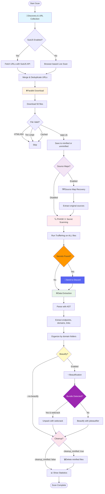

# JS Scanner v3.2

High-performance JavaScript security scanner for bug bounty hunting with batch processing, secret detection, intelligent extraction, and enhanced reliability.

## ✨ What's New in v3.2

- ✅ **Config Validation on Startup** - Comprehensive validation with helpful error messages
- 📊 **Progress Reporting & ETA** - Real-time progress bars with throughput metrics and time estimates
- 🔒 **Enhanced Browser Cleanup** - Thread-safe Playwright cleanup prevents orphaned processes
- 🌲 **Improved Tree-sitter Messages** - User-friendly fallback messages (no more alarming warnings)
- 🔔 **Notification Queue Limits** - Discord queue size limit (1000) prevents memory exhaustion
- 🔁 **Smart Rate Limit Recovery** - Max 3 retries on 429 errors with backoff
- 🎯 **Config Change Detection** - Warns when resuming scans with modified configs
- 📝 **Structured Logging** - Optional context-aware logging with extra fields
- 💬 **Better Error Messages** - Specific Discord webhook errors (404/400/429) with solutions
- ⚡ **--no-extraction Flag** - Skip data extraction phase (PHASE 4) while keeping secret scanning
- 🔧 **--no-beautify Fix** - Fixed flag to properly skip beautification (PHASE 5)

### Previous Versions

**v3.1**

- 🔄 **Automatic Retry Logic** - Resilient HTTP/subprocess operations with exponential backoff
- 💾 **Checkpoint System** - Resume interrupted scans with `--resume` flag
- 🎯 **Enhanced Minification Detection** - 5-heuristic scoring for accurate detection
- 📢 **Smart Discord Notifications** - Verified secrets sent immediately, unverified batched by domain
- 🧩 **Dynamic Import Detection** - Detects code splitting patterns (import(), React.lazy(), webpack chunks)

## 📊 Workflow

<details>
<summary><b>CLICK TO VIEW!</b></summary>



</details>

## Quick Start

```bash
# Install dependencies
pip install -r requirements.txt
playwright install chromium

# Configure
copy config.yaml.example config.yaml
# Edit config.yaml - set Discord webhook, adjust settings

# Run scan
python -m jsscanner -t target --subjs -u https://example.com
```

## Usage

```bash
# Single URL
python -m jsscanner -t myproject -u https://example.com/app.js

# With SubJS discovery
python -m jsscanner -t myproject --subjs -u https://example.com

# SubJS only (fast)
python -m jsscanner -t myproject --subjs-only -u https://example.com

# Multiple URLs
python -m jsscanner -t myproject -i targets.txt

# Force rescan
python -m jsscanner -t myproject -u https://example.com --force

# Skip beautification (faster)
python -m jsscanner -t myproject -u https://example.com --no-beautify

# Skip extraction (fastest - secrets only)
python -m jsscanner -t myproject -u https://example.com --no-extraction

# Source maps
python -m jsscanner -t myproject -u https://example.com --source-maps
```

## Features

### Core Capabilities

- ✅ **Multi-domain concurrent scanning** - Process thousands of domains in parallel
- ✅ **SubJS integration** - Fast JavaScript discovery via SubJS API
- ✅ **Browser crawling** - Playwright-based live site scanning with lazy-load detection
- ✅ **Batch processing** - Download → Scan → Extract → Beautify in optimized phases
- ✅ **Secret detection** - TruffleHog integration with Discord notifications
- ✅ **AST extraction** - Tree-sitter based parsing for endpoints, domains, links
- ✅ **Source map recovery** - Reconstruct original source files
- ✅ **Bundle unpacking** - Webcrack integration for Webpack/Vite/Parcel bundles
- ✅ **Domain organization** - Results organized by domain folders
- ✅ **Smart filtering** - Noise reduction for CDNs and known libraries

### Recent Updates

**v3.2 (Current)**

- ✅ Config validation on startup with detailed error messages
- 📊 Progress tracking with ETA calculation and throughput metrics
- 🔒 Thread-safe browser cleanup with proper error handling
- 🌲 User-friendly tree-sitter fallback messages
- 🔔 Discord notification queue limits (prevents memory issues)
- 🔁 Rate limit recovery (max 3 retries on 429 errors)
- 🎯 Config change detection for resume operations
- 📝 Structured logging support with context fields

**v3.1**

- 🔄 Automatic retry with exponential backoff (HTTP + subprocess)
- 💾 Checkpoint system for resumable scans
- 🎯 Multi-heuristic minification detection (5 metrics)
- 📢 Smart Discord notifications (verified immediate, unverified batched)
- 🧩 Dynamic import detection (9 patterns)
- ⚡ Configurable batching strategy per domain

**v3.0**

- ✨ Streamlined extraction (endpoints, domains, links only)
- ✨ Bundle detection with webcrack support
- ✨ Cross-version tree-sitter compatibility
- ✨ Configurable cleanup (keep/delete minified files)
- ⚠️ Removed params/wordlist features for better focus

## Results Location

```
results/[target]/
├── files/
│   ├── minified/              # Original downloaded files (if cleanup_minified: false)
│   └── unminified/            # Beautified JavaScript files
├── extracts/
│   ├── endpoints.txt          # All discovered API endpoints
│   ├── domains.txt            # All discovered domains
│   ├── links.txt              # All discovered URLs
│   └── [domain]/              # Domain-specific extracts
│       ├── endpoints.txt
│       ├── domains.txt
│       └── links.txt
├── secrets/
│   ├── aws/                   # AWS credentials
│   ├── github/                # GitHub tokens
│   ├── stripe/                # Stripe keys
│   └── [detector_type]/
├── logs/
│   └── scan.log               # Detailed scan logs
├── cache/
│   └── url_hashes.json        # Cached file hashes
├── secrets.json               # All detected secrets
├── trufflehog.json            # Raw TruffleHog output
├── metadata.json              # Scan metadata
├── history.json               # Processing history
└── file_manifest.json         # Downloaded file manifest
```

### Scan Types

```bash
# Full scan with all features
python -m jsscanner -t target --subjs -u https://example.com --source-maps

# Fast scan (SubJS only, no beautify)
python -m jsscanner -t target --subjs-only --no-beautify -u https://example.com

# Fastest scan (secrets only, no extraction/beautification)
python -m jsscanner -t target --subjs-only --no-extraction --no-beautify -u https://example.com

# Deep scan (browser crawling + source maps)
python -m jsscanner -t target -u https://example.com --source-maps

# Bulk domain scan
python -m jsscanner -t bulk-scan -i domains.txt --subjs --no-beautify
```

### Flags

| Flag              | Description                             |
| ----------------- | --------------------------------------- |
| `-t, --target`    | Target name (creates results/[target]/) |
| `-u, --url`       | Single URL to scan                      |
| `-i, --input`     | File with URLs (one per line)           |
| `--subjs`         | Use SubJS for discovery + live scan     |
| `--subjs-only`    | Use ONLY SubJS (skip browser)           |
| `--source-maps`   | Attempt to recover source maps          |
| `--resume`        | Resume from last checkpoint (v3.1)      |
| `--no-extraction` | Skip extraction phase (secrets only)    |
| `--no-beautify`   | Skip beautification phase               |
| `--force`         | Force rescan (ignore cache)             |
| `--no-live`       | Skip live browser scanning              |
| `-v, --verbose`   | Verbose output                          |

# Testing & Validation

```bash
# Run all tests (Windows)
.\tests\run_all_tests.ps1

# Run specific tests
python tests/test_direct.py
python tests/test_comprehensive_suite.py
python tests/test_bundle_unpacker.py
```
